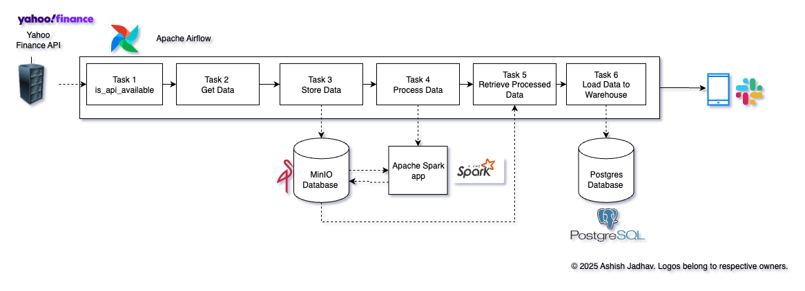

# Stock Market Data Pipeline

A data engineering pipeline built with Apache Airflow, Apache Spark, MinIO, and PostgreSQL for automated stock market data processing and analysis.

## 🏗️ Architecture Overview
The pipeline consists of 6 main tasks orchestrated by Apache Airflow:

1. **Task 1**: Check API Availability
2. **Task 2**: Get Raw Data from Yahoo Finance
3. **Task 3**: Store Data in MinIO Object Storage
4. **Task 4**: Process Data with Apache Spark
5. **Task 5**: Retrieve Processed Data
6. **Task 6**: Load Data to PostgreSQL Warehouse





## 🛠️ Technology Stack

| Component | Technology | Purpose |
|-----------|------------|---------|
| **Orchestration** | Apache Airflow | Workflow management and scheduling |
| **Data Processing** | Apache Spark | Distributed data transformation |
| **Object Storage** | MinIO | S3-compatible data lake storage |
| **Data Warehouse** | PostgreSQL | Structured data storage |
| **Containerization** | Docker & Docker Compose | Application packaging and deployment |
| **Data Source** | Yahoo Finance API | Stock market data provider |

## 📁 Project Structure

```
airflow-etl/
├── dags/
│   └── stock_market.py              # Main Airflow DAG
├── drawio                           # Drawio files
├── include/
│   └── stock_market/
│       └── tasks.py                 # Custom task functions
├── spark-apps/
│   └── format_stock_data.py         # Spark data processing script
├── docker-compose.override.yml      # Multi-container orchestration
├── Dockerfile                       # Custom Airflow image from Astro
├── requirements.txt                 # Python dependencies
└── README.md                        # Project documentation
```
